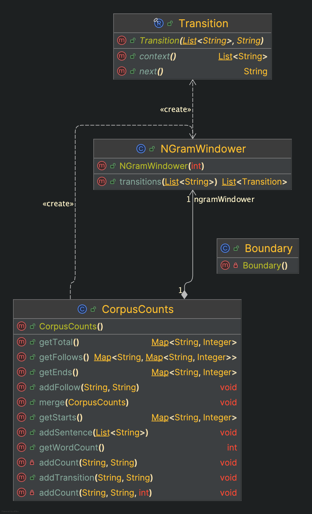
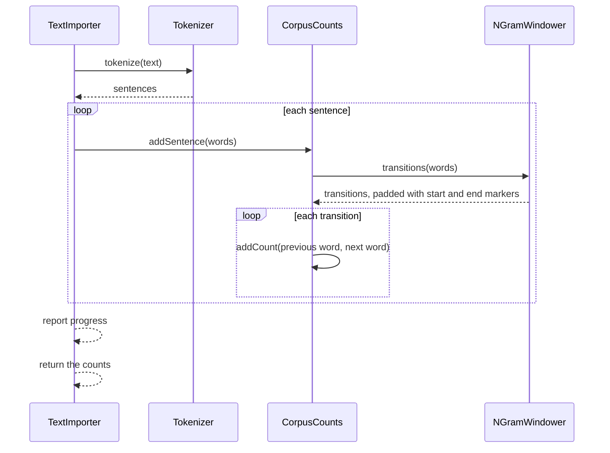
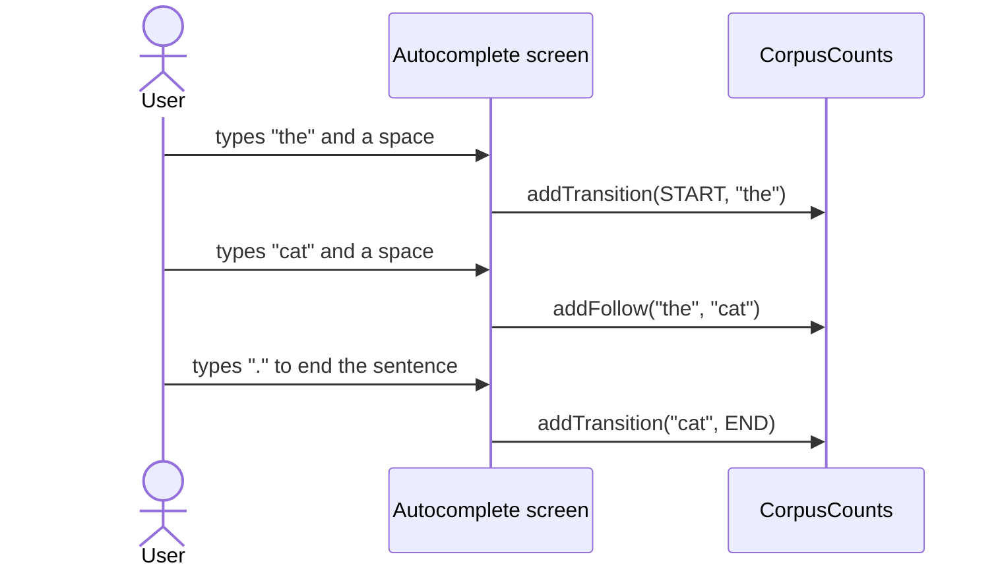

# N-gram windowing and counting design

Project: Sentence Builder (Team 23), CS4485 Senior Design
Components: `Boundary`, `Transition`, `NGramWindower`, `CorpusCounts`, package `com.team23.sentencebuilder.logic`
Author: Alen Jo. Last updated: October 9, 2026

## 1. Purpose

These classes turn tokenized sentences into the statistics that every other feature reads:
how often each word occurs, how often it starts or ends a sentence, and which words
follow it. Generation, autocomplete, and the database layer all consume this data.

Status: bigram counting is implemented. `NGramWindower` already supports any order
(including trigrams), but a trigram counter is planned, not built (see section 9).

## 2. Concepts

- An n-gram is a sequence of n words. A bigram predicts a word from the one before it;
  a trigram uses the two before it. This is the Markov assumption: only the last
  (n - 1) words matter.
- A transition is one observed step: a context (the previous word or words) and the
  word that followed.
- The probability of the next word is estimated by relative frequency (maximum likelihood):

```
P(next | previous) = count(previous, next) / count(previous)
```

- Each sentence is padded with a start marker `<s>` and an end marker `</s>`. Then
  "this word starts a sentence" is the transition `<s> -> word`, and "this word ends a
  sentence" is `word -> </s>`. Starts, ends, and followers are all the same kind of fact.

Invariant: for every real word w, its total count equals the sum of its outgoing
transition counts, including the transition to `</s>`. This is the denominator identity
in the textbook's bigram estimate, and a unit test enforces it.

## 3. Data model

`CorpusCounts` keeps two maps:

- `transitionCounts`: previous word (or `<s>`) to next word (or `</s>`) to times seen.
- `totalCounts`: real word to times it occurred. Boundary markers are never counted here.

Everything the rest of the project asks for is derived from those maps:

| Request | Derived from |
|---|---|
| Occurrences of a word | `totalCounts` |
| Times a word starts a sentence | `transitionCounts` entry for `<s>` |
| Times a word ends a sentence | `transitionCounts[word][</s>]` |
| Followers of a word | `transitionCounts[word]` without `</s>` |

Worked example for "The cat sat. The dog sat.":

| previous | next | count |
|---|---|---|
| `<s>` | the | 2 |
| the | cat | 1 |
| the | dog | 1 |
| cat | sat | 1 |
| dog | sat | 1 |
| sat | `</s>` | 2 |

Totals: the = 2, cat = 1, dog = 1, sat = 2 (6 words). Check the invariant: the has 1 + 1
outgoing = 2; sat has 2 transitions to `</s>` = 2.

## 4. Design

### 4.1 Classes


### 4.2 Counting an imported text



### 4.3 Incremental counting (autocomplete)



Feeding the finished sentence to `addSentence` gives the same counts. A unit test checks that.

## 5. Decisions and tradeoffs

| Decision | Alternatives considered | Why | Cost |
|---|---|---|---|
| Store transitions, with start and end markers | Separate tables for starts, ends, and follows | One fact type; counts cannot drift apart; invariant holds by construction | Starts, ends, and follows must be derived |
| Store counts, not probabilities | Store probabilities | Counts can be updated and merged incrementally (autocomplete, generated text, multiple imports); probability is one division | The reader divides |
| String markers `<s>` and `</s>` | An enum for boundaries | They live in the same key space as real words; the tokenizer cannot produce `<` or `>`, so they cannot collide | A custom tokenizer pattern that matched angle brackets could break that |
| Windower takes an `order` | Separate bigram and trigram classes | One tested class covers both | The counts class still has to choose an order |
| `CorpusCounts` creates its own bigram windower | Inject a windower | Simpler | The order is fixed at 2 inside this class |
| Unsmoothed counts | Add-one smoothing; backoff; interpolation | Add-one is a blunt instrument for n-grams: with a large vocabulary it moves most probability to pairs that never occurred; backoff or interpolation would be the real fix | A pair never seen has probability zero, so callers handle empty follower lists |
| `getEnds` and `getFollows` rebuilt on each call | Cache them | Simple and always consistent | Each call is proportional to the number of distinct pairs, so call once and reuse |
| In-memory `HashMap` | Stream to disk | A novel fits easily | Not for gigabyte corpora |
| `Transition` as an immutable record, with `List.copyOf` contexts | A mutable class | Safe as a map key; value equality | None |
| `addFollow` as an alias for `addTransition` | A single method | Reads naturally in autocomplete code | One extra method |

## 6. Complexity

- `addSentence` is linear in the sentence length.
- `merge` is linear in the number of distinct pairs.
- `getTotal` and `getStarts` return views (constant time); `getEnds` and `getFollows` are linear in the number of distinct pairs.
- Memory is proportional to the number of distinct word pairs.

## 7. Limitations

- Unsmoothed: unseen pairs have probability zero.
- Only the last (n - 1) words are remembered, so there is no long-distance context.
- Everything is lowercased and punctuation is dropped, so output has no capitals or commas.
- Not thread-safe. Import on one thread and merge, or synchronize externally.
- The bigram counter is hard-wired to order 2.

## 8. Testing

JUnit 5:
- windower: bigram and trigram windows with boundary markers, a one-word sentence, rejection of order below 2;
- counts: words, starts, ends, and follows for a small corpus; the invariant (total equals outgoing) for every word; boundary markers never appear as words; empty sentences ignored;
- incremental `addTransition` and `addFollow` give the same counts as `addSentence`; `merge` adds counts;
- the "I am Sam" example from the Jurafsky and Martin lecture slides, comparing counts with the published probabilities.

## 9. References
- Jurafsky, D., and Martin, J. H. Speech and Language Processing (3rd ed. draft), Chapter 3,
  N-gram Language Models. https://web.stanford.edu/~jurafsky/slp3/