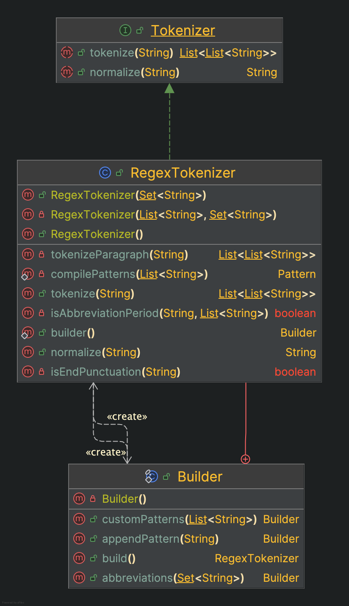
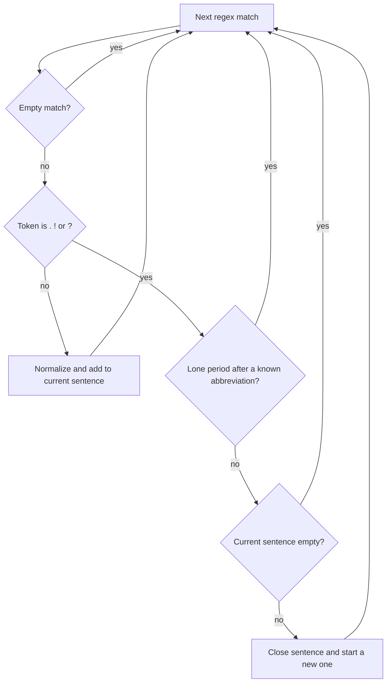
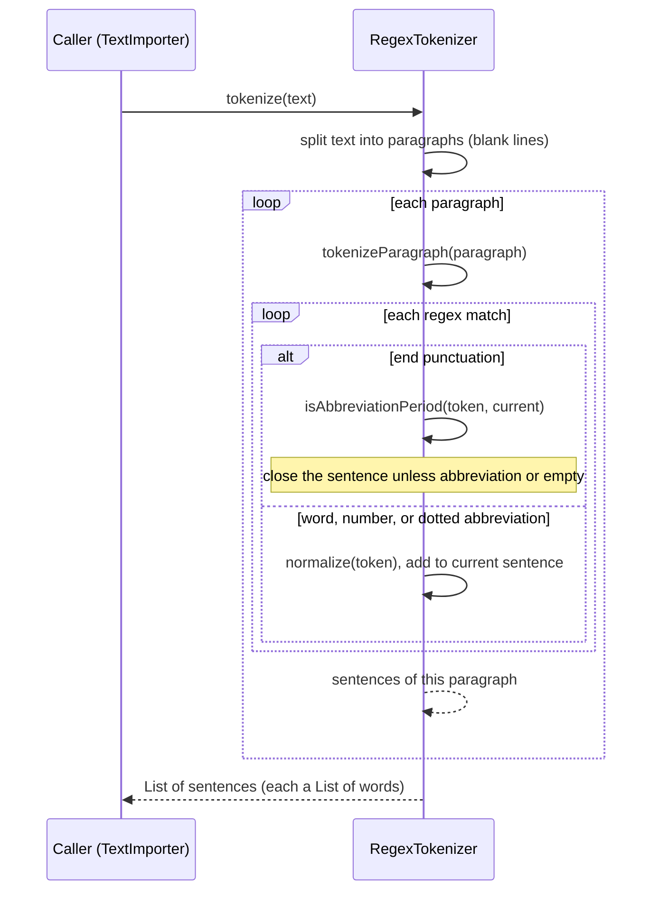

# Tokenizer design
Project: Sentence Builder (Team 23), CS4485 Senior Design
Component: `Tokenizer` and `RegexTokenizer`, package `com.team23.sentencebuilder.logic`
Author: Alen Jo. Last updated: October 9, 2026

## 1. Purpose

Here we answer, "What, exactly, is a word in this context?" from the project description that Cole gave us.
It turns raw text into sentences, and sentences into normalized words. Everything else (counting, storage, generation, autocomplete) depends on these decisions.

## 2. Requirements

- Define a word, and use that one definition everywhere.
- Identify sentence boundaries, because the database stores how often each word starts
  and ends a sentence.
- Cope with Project Gutenberg plain text: hard-wrapped lines, headings with no
  punctuation (for example "CHAPTER I"), `_italics_` underscores, curly quotes, and `--` dashes.
- No NLP libraries (instructor rule), so it is hand-written with the Java standard library only.
- Words typed in autocomplete must map to the same stored form as imported words,
  so normalization is a public method shared by every caller.

## 3. What is a word, and what is a sentence

| Rule | Example | Result |
|---|---|---|
| Case is folded to lowercase (`Locale.ROOT`) | `The` | `the` |
| Contractions and possessives stay whole; curly apostrophes become straight | `Don’t` | `don't` |
| Hyphenated compounds stay whole | `well-known` | `well-known` |
| Double hyphens and dashes separate words | `one--two` | `one`, `two` |
| Numbers are words and may contain `:`, `.` or `,` between digits | `1:15`, `3.5`, `1,000` | kept whole |
| Dotted abbreviations stay whole, periods included | `U.S.`, `p.m.` | `u.s.`, `p.m.` |
| Commas, quotes, semicolons, parentheses, underscores are discarded | `"Yes,"` | `yes` |
| A run of `.`, `!`, `?` ends a sentence | `Wait... what?!` | two sentences |
| A period after a known abbreviation does not end a sentence | `Mr. Darcy left.` | one sentence |
| A blank line ends a sentence | `CHAPTER I` then blank line | heading is its own sentence |

Default abbreviation list: mr, mrs, ms, dr, st, jr, sr, prof, vs, mt (case-insensitive,
replaceable through the constructor or the builder).

## 4. Design

### 4.1 Classes

Callers depend on `Tokenizer`, never on `RegexTokenizer`, so a different implementation could replace it as needed.

### 4.2 How one token is handled

### 4.3 Sequence for `tokenize(text)`

### 4.4 How tokens are recognized

One combined regex is built from an ordered list of alternatives: number, dotted
abbreviation, word, sentence terminator. At each position the first alternative that
matches wins, so the number pattern must come before the word pattern (otherwise `1:15`
would match as the word `1`).

## 5. Decisions and tradeoffs

| Decision | Alternatives considered | Why | Cost |
|---|---|---|---|
| Regex-based tokenizer | Hand-written character scanner | Short, readable rules; fast enough for novels | Rules interact through ordering, which needs care |
| Lowercase everything | Keep case | `The` and `the` share counts, so the word table stays small and probabilities are meaningful | Names lose capitalization; the display layer must re-capitalize |
| Drop punctuation instead of storing it as tokens | Textbook style: punctuation as words | Clean word list; the spec asks for a list of words; generated text has no stray commas | Output lacks commas |
| Keep internal apostrophes and hyphens | Split on them | Splitting `don't` into `don` and `t` produces garbage | A trailing apostrophe is lost (`dogs'` becomes `dogs`) |
| Numbers may contain `:` `.` `,` | Split numbers on punctuation | `1:15` and `3.5` stay whole; no false sentence break inside a decimal | A list like `1,2,3` without spaces becomes one word |
| Hardcoded abbreviation list, overridable | Learn abbreviations from the corpus | Simple, predictable, testable; hand-written exception lists are the known simple baseline | Misses abbreviations not on the list |
| Blank line ends a sentence | Ignore paragraph breaks | Gutenberg headings have no punctuation and would glue onto the next sentence | A sentence split by a blank line is cut in two |
| `Locale.ROOT` for lowercasing | Default locale | Same result on every machine (a Turkish locale would lowercase `I` differently) | None |
| Return `List<List<String>>` | A `Token` record with raw text, capitalization, and so on | Everything downstream only needs normalized words | Extra information would require a contract change |
| `Tokenizer` interface plus Builder | Concrete class only | Swappable implementation; custom patterns and abbreviations without a constructor explosion | A little more code |
| Defensive copy and validation (`Set.copyOf`, null checks, per-pattern compile check, pattern length cap) | Trust the caller | Fails early with a clear message; later changes by the caller cannot alter behavior | Slightly more code |

## 6. Known limitations

- Initials such as "J. Austen" split a sentence.
- An abbreviation at the end of a real sentence merges it with the next one ("I met Dr.").
- A dotted abbreviation at the end of a sentence ("in the U.S.") does not end it, because the token swallows its period.
- Patterns added with `appendPattern` run last, so in practice they only see text the defaults ignore (emoticons, symbols).
- Not tuned for non-English text, although `\p{L}` accepts accented letters.

## 7. Testing

JUnit 5, written against the `Tokenizer` interface where possible:
- sentence splitting, abbreviations (including upper case), repeated terminators, a last sentence with no terminator, hard-wrapped lines;
- blank-line boundary, including Windows line endings;
- contractions, hyphens, curly apostrophes, numbers (`1:15`, `3.5`, `1,000`), dotted abbreviations (`U.S.`, `p.m.`), accented letters;
- discarded punctuation (commas, quotes, `--`, `_italics_`);
- empty and punctuation-only input;
- `normalize` matches what `tokenize` produces;
- configuration: custom abbreviations, case-insensitive abbreviations, invalid patterns, null input;
- one test documents a known limitation (trailing apostrophe) so changing the behavior later is a deliberate decision.

## 10. References
- Jurafsky, D., and Martin, J. H. Speech and Language Processing (3rd ed. draft), Chapter 2,
  text normalization and tokenization, and Chapter 3, N-gram Language Models.
  https://web.stanford.edu/~jurafsky/slp3/